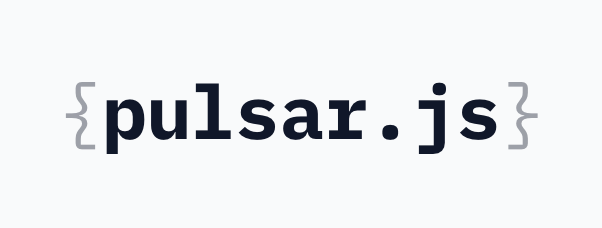

> Captures Core Web Vitals, API latencies, client-side crashes, and UI failures — designed for maximum performance and privacy. Deep Commerce Context. No session replay, no PII, no consent banner required.

1. **Zero-Dependency Core**: Connects directly to native browser APIs (`PerformanceObserver`, `navigator.sendBeacon`, `fetch`/`XHR` interception) with no third-party libraries.
2. **Core Web Vitals**: LCP, INP, CLS, TTFB, FCP — measured via `PerformanceObserver` during browser idle time.
3. **SFCC Context Awareness**: Knows *Checkout Step 2* was slow for a *Guest User* on a specific storefront type (PWA Kit vs. SFRA).
4. **Silent Failure Detection**: Catches `TypeError`s, unhandled promise rejections, and failed `fetch`/`XHR` calls (SLAS timeouts, SCAPI 429s).
5. **UI Breadcrumbs**: Rolling memory of the last clicks leading up to a crash — deterministic debugging without session replay.
6. **Privacy-First**: `beforeSend` hooks strip PII before payloads leave the device. Operates under merchant legitimate interest — no consent banner needed.
7. **Resilient Delivery**: Payloads flush via `sendBeacon` on `visibilitychange` with `fetch(..., {keepalive: true})` fallback.


## 📦 Repository Structure

```
pulsarjs/
├── packages/
│   └── sdk/              # Browser SDK pixel
│       ├── src/
│       │   ├── index.js       # Entry point (→ pulsar.js build output)
│       │   ├── core/          # Config, scope, session, capture pipeline
│       │   ├── collectors/    # Errors, network (fetch/XHR), RUM
│       │   ├── integrations/  # SFCC context extraction
│       │   └── utils/         # Sanitizers, environment
│       └── tests/           # Integration configs
├── GEMINI.md             # Engineering manifesto & context
└── docs/BACKLOG.md       # Product backlog
```

---

## 🚀 Quick Start

```html
<!-- Drop into any SFCC storefront -->
<script src="https://api.pulsarjs.com/pulsar.js"></script>
<script>
  Pulsar.init({
    clientId: 'your-project-key',
    storefrontType: 'PWA_KIT', // or 'SFRA' | 'HEADLESS'
    enabled: true,
    debug: false,
    beforeSend: function(event) {
      // Modify or drop events before they leave the browser
      // return null to drop
      return event;
    }
  });
</script>
```

---

## License

Proprietary. All rights reserved.